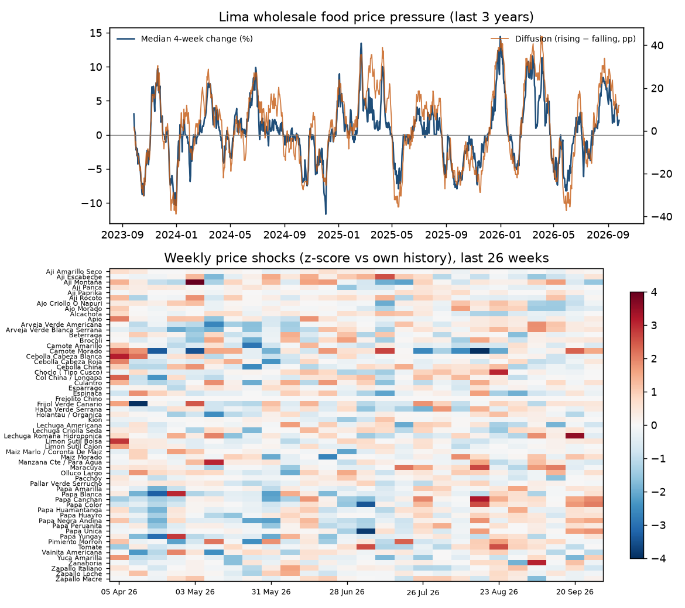

# Lima wholesale food prices: daily pipeline, quality checks and dashboard

[](https://github.com/Rodgrandez/lima-food-prices-pipeline/actions/workflows/ci.yml)
[](https://rodgrandez.github.io/lima-food-prices-pipeline/)

**Live dashboard: https://rodgrandez.github.io/lima-food-prices-pipeline/**

A daily, automated pipeline for wholesale food prices at Lima's main wholesale market (Gran Mercado Mayorista de
Lima), published by MIDAGRI-SISAP. It downloads and normalises the data, runs explicit data-quality checks, computes
price-change, volatility and price-pressure indicators, and republishes a static Plotly.js dashboard daily.



<!-- STATUS:START -->
**Snapshot with data through 2026-09-29**, 59 active varieties at the Gran Mercado Mayorista de Lima. Current figures: [live dashboard](https://rodgrandez.github.io/lima-food-prices-pipeline/).

- Median 4-week price change: **+2.6%**; diffusion (share rising >10% minus share falling >10%): **+11.9 pp**.
- Largest 4-week rises: Lechuga Romana Hidroponica (+49.3%), Arveja Verde Blanca Serrana (+48.9%), Zanahoria (+46.7%), Arveja Verde Americana (+43.5%), Papa Unica (+41.2%).
- Largest 4-week falls: Vainita Americana (-63.6%), Ajo Criollo O Napuri (-39.4%), Ajo Morado (-31.0%), Lechuga Americana (-29.0%), Pacchoy (-25.5%).
- Data quality (2010-01-01 to 2026-09-29): 359,857 clean observations, 0 duplicates, 0 non-positive prices and 79 outliers removed; median coverage 99%; 1 variety currently stale, 6 discontinued, 1 uncategorised.
<!-- STATUS:END -->

## Pipeline
1. **Download**: the SISAP portal is queried in six-month chunks (it rejects longer ranges); daily updates
   re-download the last 60 days to capture revisions and merge them into the existing panel.
2. **Normalise**: one row per date and variety; each variety is mapped to its product and category using the
   portal's daily tables.
3. **Quality checks**: duplicates, non-positive prices, isolated glitches (a price more than 0.7 log points away
   from the median of the previous 15 observations that is back near that median the next day; persistent level
   shifts are real price moves and are kept), stale prices (unchanged for 30+ observations, flagged but kept),
   discontinued and uncategorised varieties. The report is rebuilt from the full raw history
   and published with every update.
4. **Indicators**: 7-day average price; 4-week and 12-month log changes; 28-day volatility of daily log changes;
   weekly shocks as z-scores against each variety's own history; and a price-pressure indicator (median 4-week
   change across varieties and a diffusion index: share rising more than 10% minus share falling more than 10%).
   Units differ across varieties (kg, litre or unit) and the source does not say which, so all indicators use
   changes, never levels across varieties.
5. **Publish**: the static site (HTML, JS and JSON) is pushed to the `gh-pages` branch and served by GitHub Pages.

## Automation
The SISAP portal does not answer GitHub-hosted runners (connections time out). The daily update therefore runs
on a machine in Lima (Windows Task Scheduler, `scripts/update.ps1`; a failed run is retried up to three times, 30 minutes apart), which rebuilds the site and
pushes it to `gh-pages`, on the days that machine is on. The "data through" badge always shows the date of the
latest data actually published.
CI (lint and tests) runs on GitHub Actions and needs no network access.

## Reproduce
```bash
conda env create -f environment.yml && conda activate food-prices
make all      # full download since 2010 and build of site/
```

Data: MIDAGRI – SISAP (public). License: MIT.
